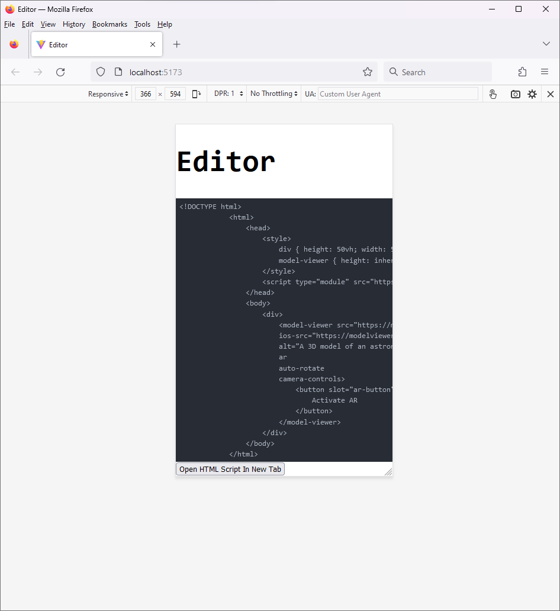
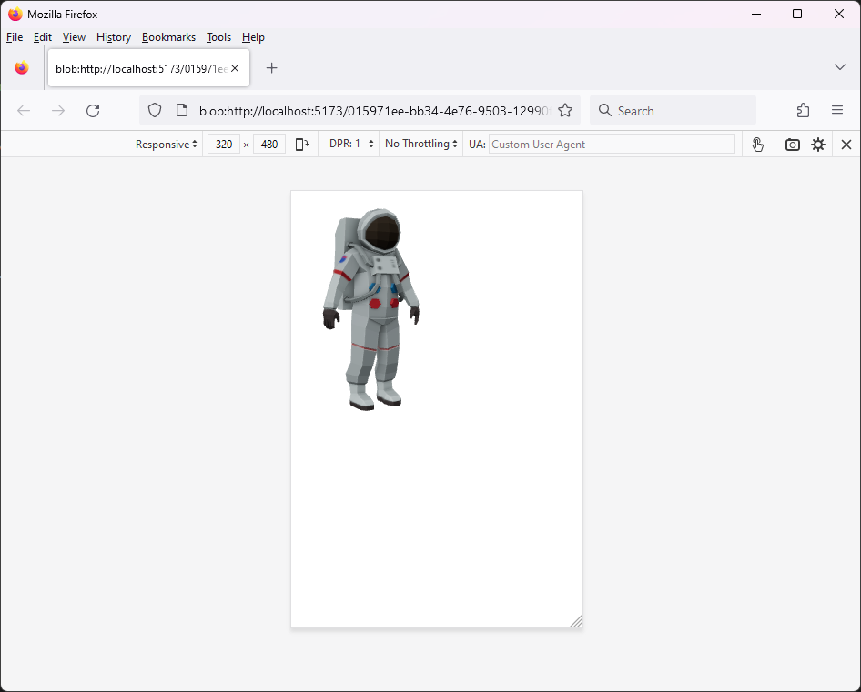

# whynot

Working on environment that manipulate HTML and can be used from smartphone.

Currently usable to script Augmented Reality apps in browser in your smartphone.





## Tricks used so you don't need to check code

```js
// Wraps content of editor and opens new tab in it
function openNewTab(code: string) {
    const winHtml = code;
    const winUrl = URL.createObjectURL(
        new Blob([winHtml], { type: "text/html" })
    );
    window.open(winUrl)
}
```

## Features

- Opens modified HTML in new tab. 
    - Click "Open In New Tab" to see demo.

